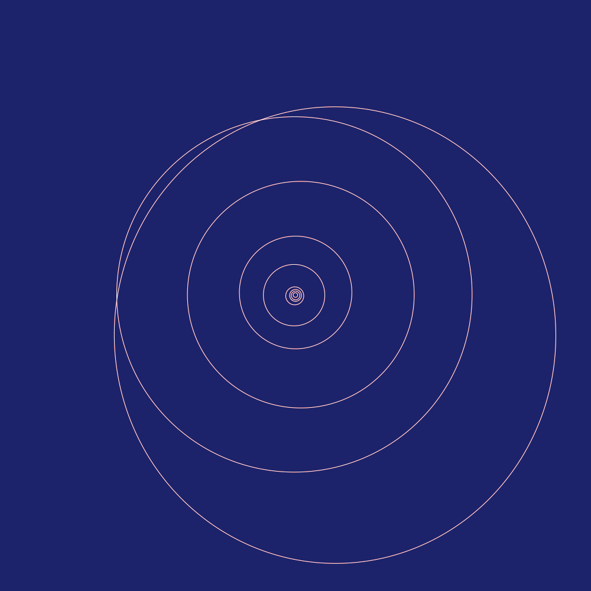
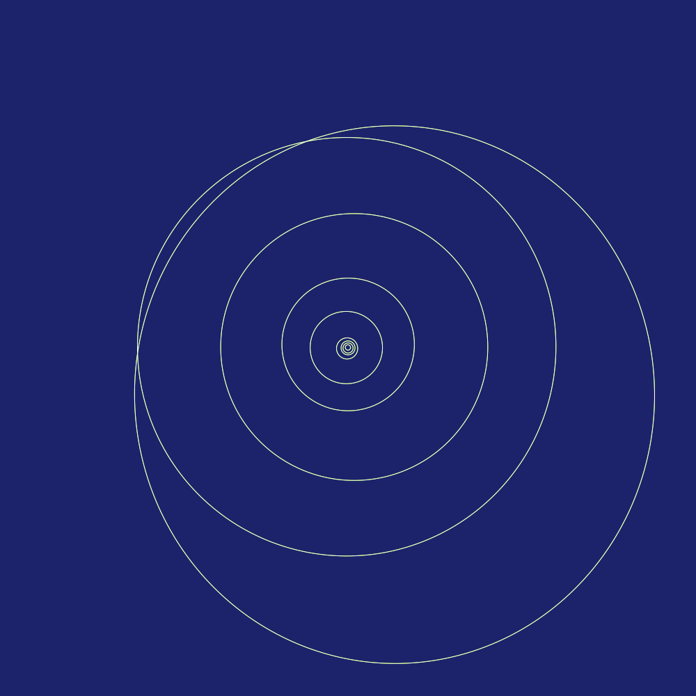

# Orbits - Orbital Mechanics Library for Nim.

Orbits are beautiful, with their gentle curves and sweeping arcs. They have captivated astronomers for thousands of years and have made mathematics and physics to what they are today. There is so much to the orbits if you dig dipper. Where do you get most accurate data? How do you compute transfer windows? Can you plot trajectories of spacecraft? This is what this library is about. An exploration of deep beyond with Nim at your side.

#  Simple Elliptical Orbits.

Let's start out with some simple orbits that follow the simplest elliptical model. Here is how you can get position of the planets at any time and plot it:


```nim
for planet in simpleElements:
  var step = planet.period / 360
  for i in 0..360:
    let pos = planet.posAt(step * float(i)) / AU
    ctx.lineTo(pos.x, pos.y)
  ctx.stroke()
```

You do this using `orbital elements`. The minimum number of orbital elements you need are:

  * o: Longitude of the ascending node
  * i: Inclination
  * w: Argument of periaps
  * a: Semi-major axis, or mean distance from Sun
  * e: Eccentricity (0=circle, 0-1=ellipse, 1=parabola)
  * m: Mean anomaly (0 at perihelion increases uniformly with time)
  * n: Mean motion

If you have exact time, you can turn `orbital elements` into `orbital vectors` which are

  * pos: x, y, z -- position
  * vel: x, y, z -- velocity

Then you can accutally plot `orbital vectors`.


# Kernel Files Orbits

NASA uses [.bsp SPICE SP-kernels](https://naif.jpl.nasa.gov/pub/naif/toolkit_docs/C/info/intrdctn.html) files which accurately describe the orbits of planets with [chebyshev polynomials](https://en.wikipedia.org/wiki/Chebyshev_polynomials) after folks at JPL have collected all observation and ran them through supercomputer simulations. These orbits can be [downloaded](https://naif.jpl.nasa.gov/pub/naif/generic_kernels/spk/) from NASA and are pretty accurate. Unfortunately they only exist from about 1000 AD to 3000 AD and only the larger bodies of solar system. Smaller bodies that don't have spice kernels need to use orbital elements to extarpolate their simpler elliptical orbits.

You can find SPK files here: https://naif.jpl.nasa.gov/pub/naif/generic_kernels/spk/

```nim
var spkFile = readSpk("tests/de435.bsp")
for planet in complexElements:
  var step = planet.period / 360
  for i in 0..360:
    let time = step * float(i)
    let pos = spkFile.posAt(time, planet.id, 0) / AU
    ctx.lineTo(pos.x, pos.y)
  ctx.stroke()
```



Here you can see [Mercury precession](https://en.wikipedia.org/wiki/Tests_of_general_relativity#Perihelion_precession_of_Mercury). This is drawing 5 full orbit of merkury every 20 earth years. You can see the "wobble" of Merkury's orbit over 100 earth year time span.


# JPL Horizon Orbits

If getting data dumps from NASA is not enough you can also connect to NASA servers directly over [TELNET](https://en.wikipedia.org/wiki/Telnet) and query their databases in realtime. You can download a ton of interesting information from the [JPL Horizon System](https://ssd.jpl.nasa.gov/?horizons) you can’t get anywhere else. Thousands of positions of small bodies, asteroids, comets and select spacecraft throughout the solar system.



```nim
var hz = newHorizonClient()
for planet in simpleElements:
  let entries = hz.getOrbitalVectorsSeq(
    0.0,
    planet.period,
    360,
    planet.id, 0)
  for entry in entries:
    let pos = entry.pos / AU
    ctx.lineTo(pos.x, pos.y)
  ctx.closePath()
  ctx.stroke()
hz.close()
```

You can get positions of many things, Including spacecraft:


Position of SpaceX's launched Starman riding a Elon's Cherry Tesla with NASA's accuracy.


# Simulations

You can also use this to simulate the solar system:


# Astrometry

You can also draw star fields and compute star positions:


Given an image of a star field you can find the brightest stars and using the stars you can find the patch of sky you are looking at.


Ever though about navigating by the stars?


Finding names of stars from a pictures:


