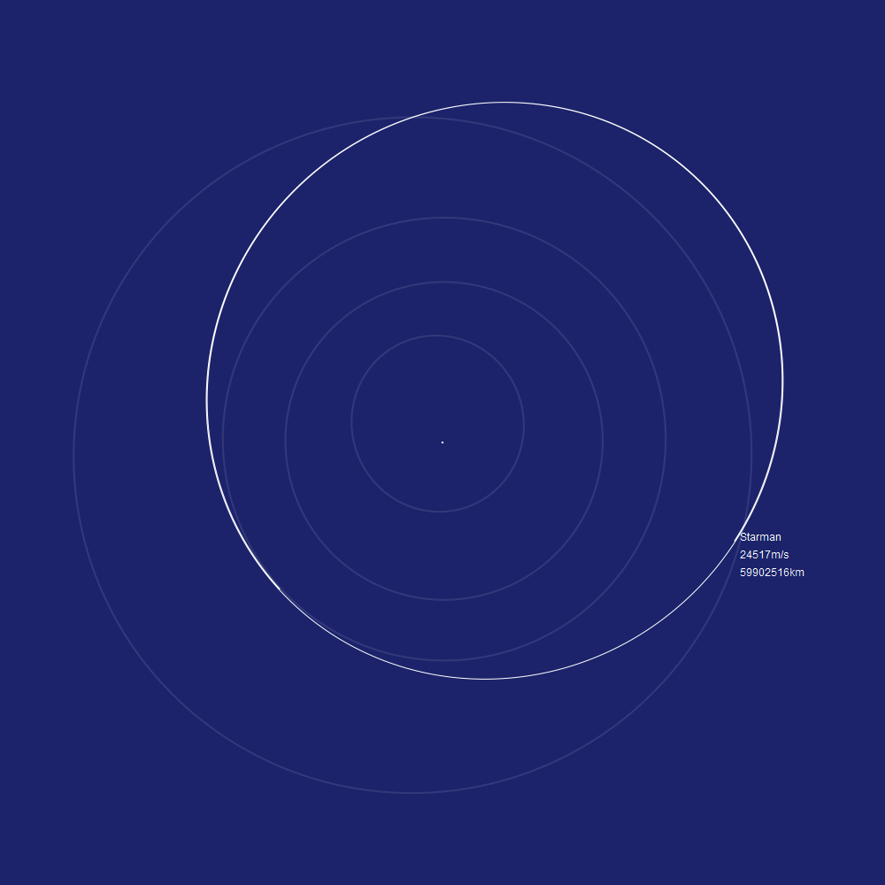

Orbits - orbital mechanics library for nim.

#  Simple Elliptical Orbits.

Simple orbits follow the simplest elliptical model. Here is how you can get position of the planets at any time and plot it:


```nim
for planet in simpleElements:
  var step = planet.period / 360
  for i in 0..360:
    let pos = planet.posAt(step * float(i)) / AU
    ctx.lineTo(pos.x, pos.y)
  ctx.stroke()
```

# Kernel Files Orbits

NASA uses .bsp SPICE SP-kernels files which accurately describe the orbits of planets with chebyshev polynomials after folks at JPL have collected all observation and ran them through supercomputer simulations. These orbits can be downloaded from NASA and are pretty accurate. Unfortunately they only exist from about 1000 AD to 3000 AD and only the larger bodies of solar system. Smaller bodies that dont spice kernels need to use simple elliptical orbits.

You can find SPK files here: https://naif.jpl.nasa.gov/pub/naif/generic_kernels/spk/

```nim
var spkFile = readSpk("tests/de435.bsp")
for planet in complexElements:
  var step = planet.period / 360
  for i in 0..360:
    let time = step * float(i)
    let pos = spkFile.posAt(time, planet.id, 0) / AU
    ctx.lineTo(pos.x, pos.y)
  ctx.stroke()
```


Here you can see Merkury precession. This is drawing 5 full orbit of merkury every 20 earth years. You can see the "wobble" of Merkury's orbit over 100 earth year time span.


# JPL Horizon Orbits

If getting data dumps from NASA is not enough you can also connect to NASA servers directly over TELNET and query their databases. You can download a ton of interesting information from the JPL Horizon server you can’t get anywhere else. Thousands of positions of small bodies throughout the solar system.


```nim
var hz = newHorizonClient()
for planet in simpleElements:
  let entries = hz.getOrbitalVectors(
    0.0,
    planet.period,
    360,
    planet.id, 0)
  for entry in entries:
    let pos = entry.pos / AU
    ctx.lineTo(pos.x, pos.y)
  ctx.closePath()
  ctx.stroke()
hz.close()
```

You can get positions of many things, Including spacecraft:


Position of SpaceX's launched Starman riding a Elon's Chrry Tesla with NASA's accuracy.




